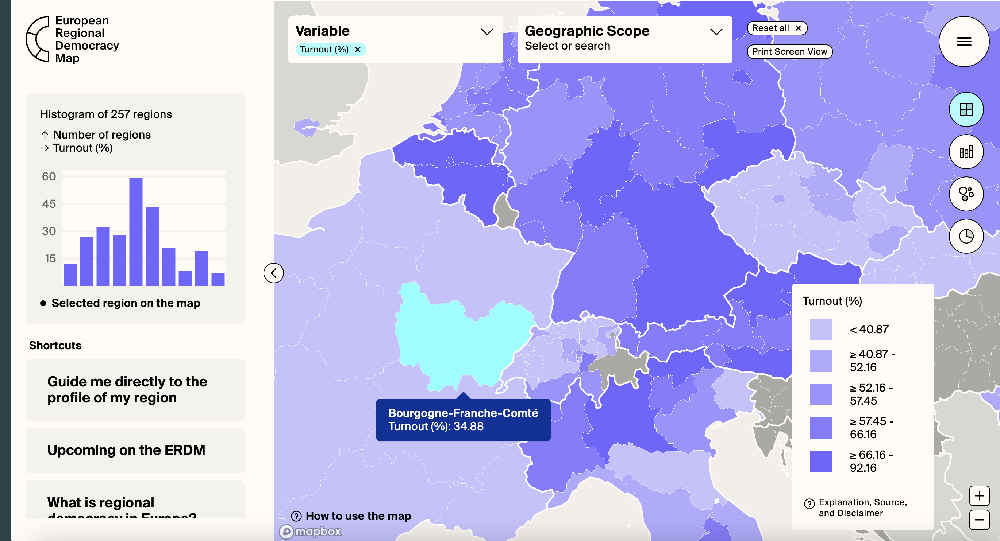
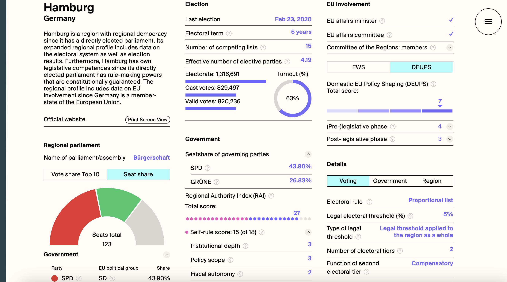

## Research interests

My research is located at the intersection of political sociology and democratic theory: I study the transformation of political representation and participation in liberal democracies and its implications for the desirability and feasibility of institutional reforms. A political scientist and theorist by training, I have conducted qualitative fieldwork in different European countries and I am currently involved in a multi-method project developing new survey measures of political process preferences in Western Europe ([PoPPiE](https://poppieproject.com/)). 

In my research, I specialise in the comparative study of political participation and institutional design in Europe. I also have a strong interest in the European Union; my [first article](https://doi.org/10.1080/13501763.2025.2554911) on the role of democratic innovations in the EU has been published in the Journal of European Public Policy. Currently, I am working on different papers that use quantitative methods and survey data to expand on the empirical findings and theoretical propositions of my doctoral research. These projects aim to explore the realistic conditions of implementing institutional reform and innovation, focusing on their public, political dynamics — and theorising the implications of these conditions for the promises of participatory and deliberative initiatives.

## Publications

:::::: folding-section
::: folding-header
[Simulating democratic reform in the EU: self-legitimation through participatory innovation]{.header-main}[, Journal of European Public Policy, 2025, DOI: 10.1080/13501763.2025.2554911]{.header-right}
:::

::: folding-content
[Abstract]{.abstract-toggle} [Article](https://doi.org/10.1080/13501763.2025.2554911){.external-link target="_blank"} [Data](https://doi.org/10.17605/OSF.IO/JHCXT){.external-link target="_blank"}
:::

::: {.full-content .small-text}
The European Commission has increasingly invested in forms of direct citizen engagement, recently establishing European Citizens' Panels as part of its ‘new push for European Democracy’. While such processes have usually been explained as efforts at institutional legitimation, participatory innovations in the EU prove theoretically puzzling: Their strategic and functional value for the Commission remains elusive. This paper develops an alternative theoretical proposition: Rather than legitimating the Commission to an external audience, participatory innovation functions as a simulation of democratic reform that addresses a need for self-legitimation. The analysis demonstrates that participatory innovation can provide the means of self-legitimation precisely because it does not realise democratic participation but enacts a performance of democratic reform. This performance should be understood as a simulation of reform that is both produced by the Commission with a field of advocates, experts, and participation professionals, and designed primarily for this same field of actors. In this way, the instrumental value of participatory innovation lies in how it justifies the work and authority of the Commission to itself. The theoretical proposition is grounded in an empirical study that draws on document analysis of institutional discourse, data on affiliations between actors in the field, and elite interviews.

*Keywords: legitimation; European Union; citizen engagement; democratic innovations; institutional reform; social theory*
:::
::::::

## Work in progress

:::::: folding-section
::: folding-header
[Politicising democratic innovations? Evidence on the divided public resonance of minipublics]{.header-main}[, Working paper]{.header-right}
:::

::: folding-content
[Abstract]{.abstract-toggle}
:::

::: {.full-content .small-text}
*— Working paper, presentation at EPSS 2026*

Democratic innovations such as deliberative mini-publics are promoted to revitalise democratic governance – for instance, by moderating partisan polarisation and rationalising public debate. Importantly, these promises depend on democratic innovations having a distinct public resonance: the wider citizenry, beyond the few citizens actually involved, is expected to evaluate such innovations as more legitimate than the status quo. We test this claim through a multi-methods study in Western Europe. We first conduct group interviews (n=110) in Italy, Germany, and Ireland to understand *how* different groups of citizens make sense of the abstract institution of a mini-public. Based on these data, we develop three propositions about their public resonance. We propose that, first, there is a systematic divide between symbolic and politicised appraisals of democratic innovations – contrasting evaluative perspectives that are likely to produce divergent reactions under real-world political conditions. Second, the new 'cultural' cleavage in advanced democracies shapes respondents' political understanding of democratic innovations. Third, these systematically different understandings are substantively conflicting – pertaining to incongruent normative expectations towards mini-publics, and arguably citizen engagement more broadly. To test these theoretical propositions, we conduct a representative survey experiment. Priming respondents' political identities and perspectives, we will leverage open-ended survey questions and quantitative text analysis to investigate how groups on opposite sides of the political cleavage describe their understanding and expectations of democratic innovations.

*Keywords: democratic innovation; politicisation; cleavage politics; political reasoning; open-ended survey questions*
:::
::::::

:::::: folding-section
::: folding-header
[Democratic innovation without participation - Being involved rather than getting involved]{.header-main}[, Working paper]{.header-right}
:::

::: folding-content
[Abstract]{.abstract-toggle}
:::

::: {.full-content .small-text}
*— Work in progress*

An influential body of scholarship describes the emergence of post-modern participatory demands in Western democracies: Citizens, and especially younger generations, are seeking greater and more individualised involvement in political decision-making. Democratic innovations such as citizens' assemblies and deliberative party reform are advocated as institutional responses to this popular demand for more participatory politics. We challenge this interpretation by focusing on the conflicting *meanings* of participation that underlie stated preferences and reactions amongst the public. Our argument is based on two empirical propositions. First, such participatory demands bear on different and substantively conflicting understandings of citizen engagement and participatory politics. Second, for a majority of the public, these understandings are not associated with individual participation; they construct the citizen as a relatively passive observer rather than an active agent. Support for greater citizen engagement and a more participatory politics, we suggest, rests to a significant extent on notions and potential expectations of *being* involved by rather than *getting* involved oneself. We develop these propositions through a series of qualitative group interviews in three West European countries and test them in two original surveys that leverage open-text responses.

*Keywords: Democratic innovations; participation; process preferences; Western Europe*
:::
::::::


```{=html}
<!--
:::::: folding-section
::: folding-header
[The many-public: Challenging the empirical legitimacy of deliberative innovations]{.header-main}[, Working paper, with [Elena Pro](https://elena-pr.github.io){target="_blank"}]{.header-right}
:::

::: folding-content
[Abstract]{.abstract-toggle}
:::

::: {.full-content .small-text}
*— Paper accepted for presentation at MPSA Annual Conference 2025, Chicago, IL*

Citizens' assemblies and other deliberative mini-publics (DMPs) are promoted as means to rejuvenate liberal democracy in the West. Advocates and scholars of DMPs maintain that these forms of direct citizen engagement are externally legitimate: their process is likely to find public acceptance, their outcomes to be perceived as fairer than those of mere representative institutions – not only among participants in the DMP itself. Based on the synthesis of different strands of empirical evidence and an original qualitative study, we challenge this proposition. We conduct 34 vignette-based group interviews in selected regions of three Western European countries (Germany, Ireland, and Italy) to understand how different social groups react to and form opinions on DMPs. Against this background, our study re-analyses observational and experimental evidence on public perceptions of DMPs to argue that it is implausible to interpret support for these processes and their outcomes as judgements of political legitimacy. As sponsored and designed forms of participation, DMPs can mean many yet contradictory things to different groups of citizens and in different political contexts. Extrapolated to real scenarios of political opinion formation and decision-making in Europe, the study's results challenge the theoretical expectations of deliberative theory regarding the potential of DMPs to rejuvenate public confidence in the democratic process. The conclusion discusses avenues of further empirical research to test the studies' arguments.

*Keywords: legitimacy, representation, mini-publics, public opinion, group interviews*
:::
::::::
 -->
```

```{=html}
<!--
:::::: folding-section
::: folding-header
[What role for regional parliaments in the EU? A problem-based, comparative approach]{.header-main}[\[Working paper\]]{.header-right}
:::

::: folding-content
[Abstract]{.abstract-toggle}
:::

::: {.full-content .small-text}
*— Paper presented at CES Annual Conference 2022, Lisbon*

The reforms of the Lisbon Treaty introduced new political rights and instruments for regional parliaments with legislative competences in the EU. Not only but especially since Lisbon, we find a prevailing narrative that regional parliaments should be empowered and increasingly involved in EU affairs because of their potential to (further) democratise the EU. However, it remains theoretically ambiguous how their involvement does or would actually induce this democratic added value. Against this background, the paper outlines a normative analysis of the democratic role of regional parliaments in the EU: Drawing on democratic theory and comparative legislative studies, I develop a problem-based approach to analyse which regional parliamentary function could serve which democratic purpose in the multilevel system. I then apply the approach and highlight a key issue of the narrative of regional parliamentary empowerment: Juxtaposing accountability vs. responsiveness functions, I discusses the risk of false equivalence of different parliamentary functions — which is suggested by typologies of potential roles of regional parliaments in an EU multilevel parliamentary system.

*Keywords: regional parliaments; European Union; democracy; parliamentary functions*
:::
::::::
 -->
```

## Projects

### European Regional Democracy Map

As part of the [Regioparl](https://www.regioparl.com/?lang=en){target="_blank"} project (2020-22), Sarah Meyer, Mario Wolf, and I lead the design and implementation of the European Regional Democracy Map (ERDM), in a collaboration with [Arjan Schakel](https://www.arjanschakel.nl){target="blank"}. The ERDM was conceived as a hub for various kinds of information and data on the structures and political dynamics of regional democracy in Europe. Researchers can find, explore, and download a broad array of data on regional government, regional election results and governing coalitions across the continent, as well as regional involvement in EU affairs.

{fig-alt="Screenshot of the European Regional Democracy Map showing exemplary variables"}

The interactive web application provides an accessible set of tools to compare and visualise data directly on the map, allowing policy analysts and non-experts to research basic information and explore the diversity of regional political institutions.

{fig-alt="Screenshot of the European Regional Democracy Map showing regional profile"}
